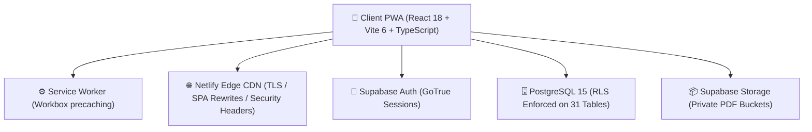

# 🎓 EduCamp — Coaching Institute Management & PWA Learning Platform

<div align="center">


**Knowledge on your Fingertips**  
*A modern, mobile-first Progressive Web Application (PWA) designed for coaching institutes, tuition centers, and schools.*

[](https://www.typescriptlang.org/)
[](https://react.dev/)
[](https://vitejs.dev/)
[](https://web.dev/progressive-web-apps/)
[](https://supabase.com/)
[](https://www.netlify.com/)
[](tests/)
[](supabase/migrations/)

[Features](#-core-features) • [Tech Stack](#-tech-stack) • [Quick Start](#-quick-start) • [Database Architecture](#-database--migrations) • [Security](#-security--rls) • [Deployment](#-production-deployment) • [Documentation](#-documentation)

</div>

---

## 📖 Overview

**EduCamp** is an end-to-end educational management platform tailored for the operational scale of modern coaching centers:
- **Capacity**: Built for **~500 students** and **~15 teachers**.
- **Multi-Board Support**: Out-of-the-box support for **CBSE**, **ICSE**, and **BSEB** (State Boards).
- **Class Coverage**: Classes **1 through 12** across multiple batches, streams (Science, Commerce, Arts), and academic years.
- **Experience**: Fast, touch-friendly, dark-themed Progressive Web App that works seamlessly on mobile phones, tablets, and desktop browsers with offline capabilities.

---

## ✨ Core Features

| Module | Features & Capabilities |
| :--- | :--- |
| 🔐 **Auth & Roles** | Secure Supabase GoTrue authentication; server-authoritative role-based access control (`admin`, `teacher`, `student`); session persistence and zero-flicker protected routes. |
| 🏛️ **Academic Master Data** | Centralized management of academic years, educational boards, class levels, streams, section batches, and curriculum subjects. |
| 👥 **Rosters & Enrollments** | Student admission registry, teacher employment records, student batch enrollments with historical tracking, and teacher subject assignments. |
| 📅 **Attendance System** | Daily session attendance marking with mobile student rosters, duplicate-prevention constraints, and aggregate student percentage cards. |
| 💳 **Fee Management** | Academic-year fee structures, installment itemization, student fee obligations, payment ledger, and sequential receipt generation (`RCP-...`). |
| 📚 **Study Materials** | Private cloud document management; chapter notes, syllabus PDFs, and revision guides scoped by board, class, and subject. |
| 📝 **Assignments** | Homework creation with teacher PDF briefs, due dates, late-submission tracking, student PDF uploads, and grading with feedback. |
| 📊 **Exams & Report Cards** | Scheduled term tests, multi-subject marks sheets, absent tracking, automatic percentage calculation, and fail-override letter grading. |
| 📢 **Communications & Notices** | Targeted broadcast announcements, priority badges (`Normal`, `Important`, `Urgent`), read/unread receipts, and personal notification center. |
| ⚡ **Offline-Ready PWA** | Installable app shell (standalone display), auto-updating service worker precache, and responsive dark UI optimized for mobile viewports. |

---

## 🛠️ Tech Stack



- **Frontend**: [React 18](https://react.dev/), [TypeScript 5.7](https://www.typescriptlang.org/), [Vite 6](https://vitejs.dev/)
- **State & Routing**: [React Router DOM v6](https://reactrouter.com/), Context API
- **Styling**: Vanilla CSS Design System with curated dark theme tokens (`#16113A`, `#0B0826`), glassmorphism, and responsive typography
- **PWA**: [vite-plugin-pwa](https://vite-pwa-org.netlify.app/), Workbox Window
- **Backend / Database**: [Supabase](https://supabase.com/) (PostgreSQL 15, PostgREST API)
- **File Storage**: Supabase Storage (Private S3-compliant buckets with signed URLs)
- **Hosting**: [Netlify](https://www.netlify.com/) with automated SPA redirects and edge security headers

---

## 🚀 Quick Start

### Prerequisites
- [Node.js](https://nodejs.org/) (v18.x, v20.x, or v22.x recommended)
- [npm](https://www.npmjs.com/) (v9+)
- A [Supabase](https://supabase.com/) project

### 1. Clone Repository
```bash
git clone https://github.com/adityaraj-projects/EduCamp.git
cd EduCamp
```

### 2. Install Dependencies
```bash
npm install
```

### 3. Configure Environment Variables
Copy the template to create your local `.env`:
```bash
cp .env.example .env
```
Edit `.env` with your Supabase credentials:
```env
VITE_SUPABASE_URL=https://your-project-id.supabase.co
VITE_SUPABASE_ANON_KEY=eyJhbGciOi...your-public-anon-key
VITE_APP_NAME=EduCamp
VITE_APP_ENV=development
```

> **Security Note**: Never expose or commit the `service_role` key. EduCamp strictly utilizes the public `anon` key coupled with PostgreSQL Row Level Security.

### 4. Run Development Server
```bash
npm run dev
```
Open [http://localhost:3000](http://localhost:3000) in your browser.

### 5. Run Automated Test Suite
```bash
node --test tests/*.test.mjs
```
Runs 50 automated tests verifying file validation, exam grading engines, multi-board isolation, RLS rules, and secret hygiene.

### 6. Build for Production
```bash
npm run build
```
Typechecks with `tsc` and compiles an optimized production bundle in `dist/`.

---

## 🗄️ Database & Migrations

All database schemas, constraints, and Row Level Security rules are organized in sequential SQL files under [`supabase/migrations/`](supabase/migrations/):

| # | Migration File | Purpose |
| :-: | :--- | :--- |
| `00` | [`20261003000000_create_profiles_and_auth.sql`](supabase/migrations/20261003000000_create_profiles_and_auth.sql) | Profiles table, user roles enum (`admin`, `teacher`, `student`), auth trigger |
| `01` | [`20261003000001_create_academic_master_data.sql`](supabase/migrations/20261003000001_create_academic_master_data.sql) | Academic years, boards, classes, streams, batches, subjects |
| `02` | [`20261003000002_seed_academic_master_data.sql`](supabase/migrations/20261003000002_seed_academic_master_data.sql) | Master seed: CBSE, ICSE, BSEB, classes 1–12, core curriculum |
| `03` | [`20261003000003_create_students_teachers_enrollments.sql`](supabase/migrations/20261003000003_create_students_teachers_enrollments.sql) | Students, teachers, batch enrollments, teacher assignments |
| `04` | [`20261003000004_create_attendance_system.sql`](supabase/migrations/20261003000004_create_attendance_system.sql) | Daily attendance sessions, per-student records, unique constraints |
| `05` | [`20261003000005_create_fee_management_system.sql`](supabase/migrations/20261003000005_create_fee_management_system.sql) | Fee structures, obligations, ledger payments, sequential receipts |
| `06` | [`20261003000006_create_study_materials.sql`](supabase/migrations/20261003000006_create_study_materials.sql) | Study materials table, private storage bucket, PDF MIME rules |
| `07` | [`20261003000007_create_assignments_system.sql`](supabase/migrations/20261003000007_create_assignments_system.sql) | Homework briefs, student PDF submissions, deadlines, grading |
| `08` | [`20261003000008_create_exams_and_results_system.sql`](supabase/migrations/20261003000008_create_exams_and_results_system.sql) | Exams, multi-subject schedules, marks entry, grading engine |
| `09` | [`20261003000009_create_communications_and_notifications.sql`](supabase/migrations/20261003000009_create_communications_and_notifications.sql) | Announcements, audience targeting, notification center, read receipts |

---

## 🔒 Security & RLS

EduCamp enforces defense-in-depth across database, API, and storage layers:

- **100% RLS Enforcement**: Every table in the schema has `ENABLE ROW LEVEL SECURITY` active.
- **Cross-User Data Isolation**: Student A cannot read or write records belonging to Student B.
- **Academic Scoping**: Teachers can only mark attendance or enter marks for classes they are assigned to.
- **Private Document Buckets**: `study-materials` and `assignment-files` buckets reject public HTTP access; downloads require authenticated sessions or signed URLs.
- **MIME & Size Enforcement**: File uploads are strictly validated client-side and server-side to PDF format under 25 MB.
- **Zero Secrets in Frontend**: Automated scans confirm zero `service_role` keys or database credentials in client code.
- **Edge HTTP Security**: [netlify.toml](netlify.toml) injects `X-Frame-Options: DENY`, `X-Content-Type-Options: nosniff`, and `Referrer-Policy: strict-origin-when-cross-origin`.

---

## 🌐 Production Deployment

### Netlify Quick Deploy
1. Link your GitHub repository in the [Netlify Dashboard](https://app.netlify.com).
2. The build settings are pre-configured via [netlify.toml](netlify.toml):
   - **Build Command**: `npm run build`
   - **Publish Directory**: `dist`
3. Add your production environment variables in Netlify Settings:
   - `VITE_SUPABASE_URL`
   - `VITE_SUPABASE_ANON_KEY`
4. Deploy! Direct deep navigation (e.g. `/attendance`, `/fees`, `/exams`) is automatically rewritten via [public/_redirects](public/_redirects).

---

## 📁 Project Structure

```
EduCamp/
├── docs/                         # Comprehensive engineering & audit reports
│   ├── PHASE_0_SYSTEM_ARCHITECTURE.md
│   ├── PHASE_11_PRODUCTION_HARDENING.md
│   ├── PHASE_12_PRODUCTION_VALIDATION.md
│   ├── PHASE_13_PRODUCTION_SETUP.md
│   ├── PRODUCTION_DEPLOYMENT.md
│   ├── LOAD_TEST_REPORT.md
│   └── KNOWN_LIMITATIONS.md
├── public/                       # Static public assets, icons, manifest
│   ├── _redirects                # Netlify SPA fallback rule
│   ├── favicon.png
│   └── icons/                    # PWA maskable & standard icons (192, 512)
├── scripts/                      # Staging & scale data generators
│   └── generate-staging-data.mjs # 500-student realistic dataset generator
├── src/
│   ├── app/                      # Route tree with React.lazy & ErrorBoundary
│   ├── components/               # Layout, route guards, error boundaries
│   ├── features/                 # Modular domain feature screens
│   │   ├── attendance/           # Daily attendance marking & history
│   │   ├── auth/                 # Login, signup, password recovery
│   │   ├── assignments/          # Homework briefs & PDF submissions
│   │   ├── exams/                # Exam schedules, marks entry & report cards
│   │   ├── fees/                 # Structure, student obligations & receipts
│   │   ├── materials/            # Chapter notes & PDF viewer
│   │   └── notifications/        # Announcements & notification center
│   ├── lib/                      # Supabase typed client singleton
│   ├── services/                 # PostgREST query & business logic services
│   ├── styles/                   # Design system tokens & global styles
│   └── types/                    # TypeScript interfaces & database schema types
├── supabase/
│   └── migrations/               # 10 sequential PostgreSQL migration files
├── tests/                        # Automated unit & integration test suites
│   ├── hardening.test.mjs
│   ├── multi-board.test.mjs
│   ├── exam.test.mjs
│   ├── assignment.test.mjs
│   ├── material.test.mjs
│   ├── notification.test.mjs
│   └── load-test.mjs
├── netlify.toml                  # Netlify deployment & security headers config
├── vite.config.ts                # Vite config with PWA & manual chunk splitting
└── package.json
```

---

## 📚 Documentation

For in-depth architectural and operational guides, consult the [`docs/`](docs/) directory:
- [System Architecture (Phase 0)](docs/PHASE_0_SYSTEM_ARCHITECTURE.md)
- [Production Hardening Audit (Phase 11)](docs/PHASE_11_PRODUCTION_HARDENING.md)
- [Production Validation Report (Phase 12)](docs/PHASE_12_PRODUCTION_VALIDATION.md)
- [Production Setup Guide (Phase 13)](docs/PHASE_13_PRODUCTION_SETUP.md)
- [Load Testing & Benchmark Report](docs/LOAD_TEST_REPORT.md)
- [Known Limitations & Operational Notes](docs/KNOWN_LIMITATIONS.md)

---

## 📄 License

This project is licensed under the [MIT License](LICENSE).

---

<div align="center">
  <sub>Built with ❤️ for educational institutes by Aditya Raj.</sub>
</div>
