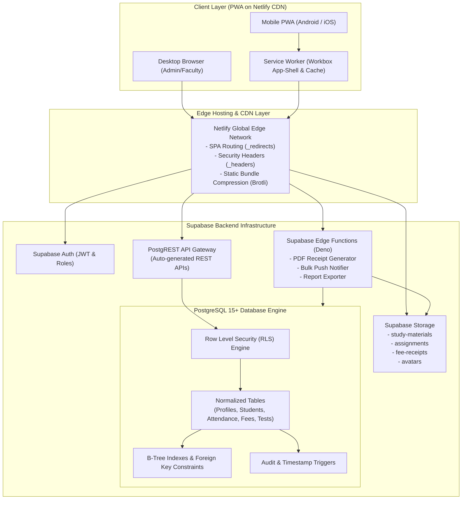
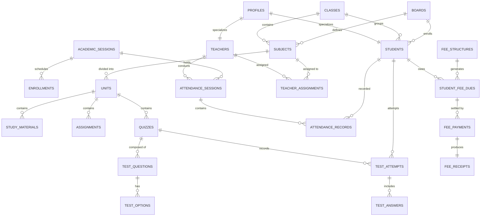

# EduCamp — Production System Architecture & Phase 0 Blueprint
**Platform:** EduCamp Educational Management & Learning PWA  
**Target Organization:** Real-World Multi-Board Coaching Institute (~500 Students, 15 Teachers, Administrators)  
**Document Version:** 1.0.0 (Phase 0 Architectural Specification)  
**Status:** Architecture Complete — Waiting for Client Approval  

---

## 1. Product Overview

EduCamp is a high-performance, mobile-first Progressive Web Application (PWA) engineered specifically for a real-world multi-board coaching institute. The platform addresses the full operational lifecycle of modern coaching institutes: from student admissions, academic configurations (Boards, Classes 1–12, Subjects, Units), daily attendance logging, and learning content delivery (PDF notes, video lectures), to assessments, fee management with automated PDF receipt generation, institutional announcements, and multidimensional academic analytics.

### Target Scale & Operating Parameters
- **Student Base:** ~500 Active Enrolled Students across Classes 1 through 12.
- **Faculty / Teachers:** ~15 Dedicated Teachers handling cross-class and cross-board subject allocations.
- **Administrative Users:** Institute Directors, Academic Coordinators, and Office Accountants.
- **Educational Boards Supported:** Multi-board data-driven architecture supporting CBSE, ICSE, BSEB (Bihar School Examination Board), and arbitrary future state or competitive foundation boards without code modifications.
- **Classes:** Class 1 through Class 12 (data-driven with numeric sorting and stream specialization).
- **Concurrency & Availability:** High-concurrency operations during peak hours (morning batch attendance, post-lecture material access, evening quiz releases).
- **Delivery Model:** PWA (Progressive Web Application) installable on Android, iOS, and Desktop devices with an offline-first app-shell and minimal network overhead.
- **Core Technology Infrastructure:**
  - **Frontend:** React, Vite, TypeScript, Mobile-First Vanilla/Tailored CSS (preserving original native UI aesthetic), Workbox PWA service worker.
  - **Backend & Database:** Supabase (Managed PostgreSQL 15+, Supabase Auth with JWT and RLS, Supabase Storage, and Deno Edge Functions).
  - **Hosting & Edge Delivery:** Netlify Global Edge CDN with continuous deployment from GitHub.

---

## 2. Existing UI Audit & User Role Matrix

### 2.1 Visual Design Tokens & Existing UI Audit
Based on a thorough inspection of the provided screenshots and the native Android reference codebase (`EduCamp`), the user interface possesses a distinct, cohesive, high-end identity that must be preserved with pixel fidelity.

#### A. Color Palette & Aesthetic Tokens
| Token Name | Hex Code | Visual Application |
|---|---|---|
| `bg_midnight_purple` | `#16113A` / `#0F0C29` | Deep luxury dark theme for Auth (Splash, Login, Signup), modal backdrops, and PWA theme color. |
| `accent_magenta_pink` | `#EC4899` / `#FF2E93` | High-impact brand accent ("CAMP" in logo, primary gradient stop, CTA links, tabs). |
| `primary_indigo` | `#6366F1` | Primary gradient start stop for buttons, interactive focus states. |
| `navy_blue` | `#000080` | Core academic theme color (App bar, continue learning cards, toolbar titles, student dashboard hero). |
| `canvas_light` | `#F5F5F5` | Neutral high-readability canvas for student/teacher/admin content workspaces. |
| `card_surface` | `#FFFFFF` | Material cards with `2dp` elevation and `12dp` to `16dp` rounded corner radii. |
| `glass_card_bg` | `rgba(255, 255, 255, 0.08)` | Glassmorphism card background used over the dark purple auth screens. |
| `text_primary_dark` | `#111827` | Headings, student names, and primary card labels on light canvas. |
| `text_secondary_muted` | `#757575` / `#9E9E9E` | Timestamps, subtitles, helper hints. |
| `logo_red` | `#D32F2F` | Critical alerts, timer countdown, logout CTA, exam paper category tint. |
| `logo_gold` | `#FFD700` | Trophy accent, notification bell highlight, quiz category tint. |
| `success_green` | `#4CAF50` | Attendance present badges, passing test results, paid fee status. |

#### B. Audit of Existing Screens & Components in Reference UI
1. **Splash Screen (`fragment_splash.xml` / Screenshot 1):**
   - Midnight purple canvas with subtle educational watermark vectors (books, graduation caps, chemistry atoms, video clapperboards).
   - High-resolution circular emblem badge (Golden trophy, laurel wreath, slogan *"तमसो मा ज्योतिर्गमय"*, and outer ring *"EDUCATION CAMPUS • ANALYSIS • DESIGN • DEVELOPMENT • IMPLEMENT • EVALUATION"*).
   - Brand Header: "EDU CAMP" (White bold "EDU" + vibrant magenta "CAMP"), sub-tagline *"Knowledge on your Fingertips"*.
   - Triple capsule loading indicator (active center pill in magenta) + "Loading..." text.
2. **Login Screen (`fragment_login.xml` / Screenshot 2):**
   - Top emblem badge, "Welcome Back! 👋" header, "Login to continue your learning journey."
   - Rounded input fields with leading icons: Person icon for "Email or Mobile Number", Lock icon for "Password" with visibility eye toggle.
   - Right-aligned "Forgot Password?" in magenta.
   - Pill-shaped gradient action button (`#6366F1` to `#EC4899`) labeled "LOGIN".
   - Subtle "── or ──" divider, and white pill "Continue with Google" button with official Google logo.
   - Footer: "Don't have an account? Sign Up".
3. **Registration / Sign Up Screen (`fragment_signup.xml` / Screenshot 3):**
   - Top emblem badge, "Create Account! 👋", subhead: "Enter your details below to join your class dashboard."
   - Fields: Full Name, Email Address, 10-digit Mobile Number, 2-column side-by-side dropdown selectors for "Select Class" and "Select Board", Password, and Confirm Password with eye toggles.
   - Action: Gradient pill button "SIGN UP".
   - Footer: "Already have an account? Login".
4. **Student Dashboard (`fragment_dashboard.xml`):**
   - Light canvas (`#F5F5F5`).
   - Top bar: "Welcome back," subtitle + bold Student Name, notification bell (gold tint), progress badge (red tint), circular profile picture with navy border.
   - Hero Banner: "Continue Learning" in deep navy `#000080`, displaying current subject ("Data Structures & Algorithms"), linear progress indicator, and "65% Completed".
   - Quick Actions (2x2 Grid): Study Notes, Video Lectures, Exam Papers, Take Quiz (cards with 12dp corners and centered icons).
   - Explore Subjects Section: Subject list items (`item_subject.xml`) with Facebook Shimmer loading skeleton (`shimmer_item_subject.xml`), empty state illustration, and Logout CTA.
5. **Study Materials & Media (`fragment_notes_list.xml`, `fragment_pdf_viewer.xml`, `fragment_videos_list.xml`, `fragment_video_player.xml`):**
   - Chapter/unit breakdown per subject (`fragment_units_list.xml`).
   - Notes list with PDF file cards, file size, download/view triggers, integrated in-app PDF viewer.
   - Video catalog with lecture duration, thumbnail, and integrated responsive video player.
6. **Assessment / Quiz Engine (`fragment_quiz.xml`):**
   - Header with red timer countdown (`Time: 00:00`) and navy question tracker (`Question 1/10`).
   - Linear progress bar showing quiz progression.
   - Elevated Question Card with 20sp bold question text.
   - Custom radio group options with pill-rounded unselected states (`bg_option_unselected.xml`) and interactive selection highlighting.
   - Primary navy "Next" / "Submit" button.
7. **Progress Analytics (`fragment_progress.xml`):**
   - Overall Average Quiz Score card (Navy hero card with 48sp score e.g. "85%", "Based on 12 quizzes").
   - Stats Grid: Notes Read counter (e.g. 24 / 40) with red progress bar, Videos Watched counter (e.g. 15 / 20) with gold progress bar.
   - Weekly activity placeholder graph.
8. **User Profile (`fragment_profile.xml`):**
   - Navy toolbar "My Profile", circular 120dp avatar, student name, email.
   - Options card with menu buttons: Edit Profile, Change Password, Admin Panel (role-guarded), About Edu Camp, Logout.
9. **Admin Dashboard (`fragment_admin_dashboard.xml`):**
   - Navy toolbar "Admin Panel", Content Management 2x2 grid: "Upload Notes", "Upload Videos", "Create Quiz", "Push Alert / Send Notification".
   - Student Insights banner: "View Student Analytics".
10. **Admin Operational Screens (`fragment_admin_student_list.xml`, `fragment_admin_create_quiz.xml`, `fragment_admin_upload_note.xml`, `fragment_admin_send_notification.xml`):**
    - Student management list with search and filter by Board & Class, edit student dialog (`dialog_edit_student.xml`).
    - Quiz builder with dynamic question entry.
    - Notes and video upload forms with title, description, subject selector, and file attachment.
    - Notification broadcast composer.

#### C. Screens Identified as Missing in UI (To Be Implemented in Future Phases)
The following essential operational screens were not present in the native Android baseline and are designated as **"UI TO BE IMPLEMENTED IN A FUTURE PHASE"** using the exact same design language and tokens:
1. **Teacher Dashboard & Workbench:** Class schedule, assigned subjects, quick attendance marker, homework submission grader.
2. **Daily Attendance Management Screen:** Grid/list for fast bulk attendance marking (Present, Absent, Late, Excused), filterable by Board, Class, and Date, with monthly attendance calendar.
3. **Fee Management & Invoicing Screen:** Fee structure configuration, student fee dues ledger, payment collection modal (Cash, UPI, Bank), and PDF receipt generator/viewer.
4. **Homework & Assignment Management:** Assignment creator with deadline, student submission portal, and grading/feedback interface.
5. **Academic Structure Admin:** Management interface for creating and modifying Academic Sessions, Boards (CBSE, ICSE, BSEB, etc.), Classes (1–12), and Subjects.
6. **Comprehensive Institutional Reporting:** Exportable class-wise attendance percentages, fee collection summaries vs outstanding balances, and academic report cards.
7. **Parent Portal (Future Extension):** Simplified parent dashboard tracking student attendance, test marks, and fee payment history.

---

### 2.2 User Role Matrix

The platform implements strict Role-Based Access Control (RBAC). Roles are stored in the database and enforced via Supabase JWT claims and PostgreSQL Row Level Security (RLS).

| Functional Capability | STUDENT | TEACHER | ADMIN | PARENT (Future) |
|---|:---:|:---:|:---:|:---:|
| **Auth & Profile Management** | View / Edit Own | View / Edit Own | Manage All Users | View Own / Student |
| **Academic Config (Boards, Classes, Subjects)** | Read Assigned | Read Assigned | Full CRUD | Read Child's |
| **View Daily Attendance** | View Own | View Assigned Classes | View All Classes | View Child's |
| **Mark / Edit Daily Attendance** | ❌ | Mark Assigned Classes | Full CRUD (Override) | ❌ |
| **Access Study Materials & Notes (PDFs)** | Read / Download | Upload / Manage Own | Full CRUD | Read-only |
| **Video Lectures** | Stream Assigned | Upload / Manage Own | Full CRUD | Stream Assigned |
| **Homework & Assignments** | Submit Solutions | Create / Grade / Review | Full CRUD | View Child's Status |
| **Take Quizzes & Tests** | Attempt Active | ❌ | ❌ | ❌ |
| **Create & Grade Tests** | ❌ | Create / Grade Assigned | Full CRUD | ❌ |
| **View Results & Academic Analytics** | View Own Progress | View Class Analytics | Institutional Analytics | View Child's Progress |
| **Fee Structures & Rates** | ❌ | ❌ | Full CRUD | Read Applicable |
| **View Fee Dues & Receipts** | View Own Dues & Receipts | ❌ | Full Ledger Access | View Child's Receipts |
| **Record Fee Payments & Issue Receipts** | ❌ | ❌ | Full CRUD | ❌ |
| **Broadcast Announcements** | Read Filtered | Post to Assigned Classes | Broadcast to All / Any | Read Filtered |
| **System Audit Logs & Backup** | ❌ | ❌ | Full Access | ❌ |

---

## 3. Complete Business Domain Map

EduCamp is partitioned into 9 decoupled business domains. Each domain owns its data entities, business rules, and service interfaces:

```
┌─────────────────────────────────────────────────────────────────────────────┐
│                             EDUCAMP DOMAIN MAP                              │
└─────────────────────────────────────────────────────────────────────────────┘

 1. ACADEMIC FOUNDATION DOMAIN       2. USER & PROFILE DOMAIN
 ├── Boards (CBSE, ICSE, BSEB...)    ├── Supabase Auth (Email / Phone)
 ├── Academic Sessions (2026-27...)   ├── Profiles (Student, Teacher, Admin)
 ├── Classes (Class 1 to 12)          └── Role-Based Access Policies
 ├── Subjects & Curriculum Mapping
 └── Units / Chapters

 3. STUDENT LIFECYCLE DOMAIN         4. TEACHER MANAGEMENT DOMAIN
 ├── Student Admission Profiles       ├── Faculty Profiles & Credentials
 ├── Board/Class Enrollment           ├── Subject & Class Allocations
 └── Student Academic Status          └── Teaching History & Logs

 5. ATTENDANCE DOMAIN                6. LEARNING & CONTENT DOMAIN
 ├── Daily Attendance Sessions        ├── Study Notes & PDFs (Supabase Storage)
 ├── Student Attendance Records       ├── Video Lectures & Catalogs
 ├── Monthly Statistics & Ratios      ├── Homework & Assignments
 └── Absentee Alerts                  └── Student Submissions & Grading

 7. ASSESSMENT & TESTING DOMAIN      8. FINANCE & FEE DOMAIN
 ├── Quizzes & Timed Tests            ├── Fee Structure per Board/Class
 ├── Question Bank & Multi-Choice     ├── Monthly/Annual Student Dues
 ├── Student Test Attempts & Scoring  ├── Payment Collection (Cash/UPI)
 └── Performance Analytics            └── Automated PDF Receipts

 9. COMMUNICATION & REPORTING DOMAIN
 ├── Targeted Announcements (Board/Class Level)
 ├── Notification Feed & Push Alerts
 └── Institutional Reports (Attendance, Fees, Academic Progress)
```

---

## 4. End-to-End Workflows

### 4.1 Daily Institute Routine Walkthrough
1. **Academic Setup (Admin, Start of Session):**
   - Admin creates the Academic Session (e.g., `2026–2027`).
   - Ensures Boards (`CBSE`, `ICSE`, `BSEB`) and Classes (`1` through `12`) are configured.
   - Maps Subjects to each Board-Class pair and assigns Faculty Teachers to classes/subjects.
2. **Student Enrollment & Onboarding:**
   - Student creates an account or Admin imports/registers student with Full Name, Mobile, Class, and Board.
   - System auto-creates `profiles` and `students` records linked to the active academic session.
3. **Morning Attendance (Teacher):**
   - Teacher launches EduCamp PWA on mobile.
   - Selects "Attendance" -> picks Class 10 (CBSE).
   - System renders the roster sorted by roll number.
   - Teacher taps "Mark All Present", unchecks the 2 absent students, and taps "Submit Attendance".
   - PostgreSQL records an `attendance_session` and bulk inserts `attendance_records` inside a transaction.
4. **Learning & Study Notes Delivery (Teacher & Student):**
   - Teacher uploads a PDF note for Class 10 Physics -> Chapter 3 "Light Reflection".
   - File is uploaded to Supabase Storage bucket `study-materials`.
   - Metadata is recorded in `study_materials`.
   - All enrolled Class 10 students receive a notification in their feed; clicking opens the integrated PDF viewer.
5. **Fee Payment & Instant Receipt (Admin & Student):**
   - Student visits the institute office to pay monthly tuition fees (Cash / UPI).
   - Admin searches student name -> opens Dues Ledger -> clicks "Record Payment" -> enters amount and payment mode.
   - System inserts `fee_payments` record, updates due status to `paid`, and triggers Edge Function `generate-receipt-pdf`.
   - Edge Function generates a signed PDF receipt stored in Supabase Storage.
   - Student and Admin can immediately view/download the receipt PDF.
6. **Quiz / Assessment Execution (Teacher & Student):**
   - Teacher schedules a 10-question timed quiz for Sunday 10:00 AM.
   - At 10:00 AM, the quiz becomes active on students' dashboards.
   - Student starts quiz -> timer counts down -> selects answers -> submits.
   - System auto-evaluates multiple-choice answers, writes `test_attempts`, computes score percentage, and updates `student_progress` stats.

---

## 5. Proposed System Architecture



---

## 6. Proposed Frontend Architecture

### 6.1 Core Technology Stack
- **Framework:** React 18+ with TypeScript (Strict mode enabled).
- **Build Tool:** Vite (Optimized production chunking, fast HMR, Rollup bundling).
- **Styling Architecture:** Vanilla CSS / Custom CSS Modules mirroring the exact Android XML styles, dimensions, colors, and elevations (avoiding generic Tailwind bloat to safeguard design fidelity).
- **Client State & Server State:**
  - **Server State Management:** TanStack Query v5 (`@tanstack/react-query`) with automatic background refetching, query caching, and optimistic mutations.
  - **Client UI State:** Zustand (lightweight store for active user role, global toast notifications, offline queue, and responsive drawer state).
- **Routing:** React Router v6 with code-splitting (`React.lazy`) and role-based route protection guards (`<AdminGuard>`, `<TeacherGuard>`, `<StudentGuard>`).
- **Icons & Visual Assets:** Lucide React (feather-style clean SVG icons) and the extracted high-resolution EduCamp brand emblem.

### 6.2 Data Flow Architecture
No raw database queries will ever reside inside React UI components. The system enforces a strict 4-tier data flow:

```
[UI Component / Screen]
       ↓ (Dispatches action or reads data)
[Custom Feature Hook] (e.g. useAttendance, useFeeLedger)
       ↓ (Manages caching, loading, refetch, and mutations)
[TanStack Query / Mutation]
       ↓ (Executes typed contract)
[Service / Repository Layer] (e.g. attendanceService.ts, feeService.ts)
       ↓ (Invokes typed SDK methods)
[Supabase Client Singleton] (createClient with Anon Key)
       ↓ (Enforces RLS at database boundary)
[PostgreSQL Database / Supabase Storage]
```

---

## 7. Proposed Backend Architecture

### 7.1 Backend Services Overview
EduCamp utilizes Supabase as a comprehensive Backend-as-a-Service (BaaS), eliminating redundant middleware while preserving relational integrity:
1. **Supabase Auth:** Handles user registration, email/password and mobile login, session refresh tokens, and password reset workflows.
2. **PostgreSQL 15+:** The single source of truth, enforcing relational integrity through foreign keys, check constraints, unique constraints, and triggers.
3. **Row Level Security (RLS):** Every single table has RLS enabled. Authorization is executed at the database layer based on `auth.uid()` and user roles.
4. **Supabase Storage:** S3-compatible object storage with fine-grained access control policies.
5. **Supabase Edge Functions:** Serverless TypeScript functions running on Deno for privileged operations:
   - `generate-receipt-pdf`: Generates tamper-proof PDF fee receipts and writes them to storage.
   - `send-notification`: Dispatches push alerts to specific boards/classes.
   - `academic-rollover`: Batch promotion of students at academic year close.

---

## 8. Proposed Database Entity Model

### 8.1 Conceptual Relational Diagram (Mermaid)



### 8.2 Detailed Entity Definitions & Schema Specifications

#### 1. `boards` (Dynamic Multi-Board Configuration)
- `id` (UUID, Primary Key, Default: `gen_random_uuid()`)
- `code` (VARCHAR(20), Unique, e.g. `'CBSE'`, `'ICSE'`, `'BSEB'`, `'STATE'`)
- `name` (VARCHAR(100), e.g. `'Central Board of Secondary Education'`)
- `description` (TEXT)
- `is_active` (BOOLEAN, Default: `true`)
- `created_at` (TIMESTAMPTZ, Default: `NOW()`)

#### 2. `academic_sessions` (Session Management)
- `id` (UUID, Primary Key)
- `name` (VARCHAR(50), e.g. `'2026-2027'`)
- `start_date` (DATE, Not Null)
- `end_date` (DATE, Not Null)
- `is_current` (BOOLEAN, Default: `false`)
- `created_at` (TIMESTAMPTZ, Default: `NOW()`)

#### 3. `classes` (Data-Driven Grades 1 through 12)
- `id` (UUID, Primary Key)
- `name` (VARCHAR(50), e.g. `'Class 10'`, `'Class 12 - Science'`)
- `numeric_order` (SMALLINT, Not Null, e.g. `1` to `12` for reliable sorting)
- `is_active` (BOOLEAN, Default: `true`)

#### 4. `subjects` (Board and Class Curriculum Mapping)
- `id` (UUID, Primary Key)
- `board_id` (UUID, Foreign Key -> `boards.id` ON DELETE CASCADE)
- `class_id` (UUID, Foreign Key -> `classes.id` ON DELETE CASCADE)
- `name` (VARCHAR(100), e.g. `'Mathematics'`, `'Physics'`)
- `code` (VARCHAR(30), e.g. `'CBSE-10-MATH'`)
- `icon_url` (TEXT)
- `is_active` (BOOLEAN, Default: `true`)

#### 5. `units` (Chapters / Modules per Subject)
- `id` (UUID, Primary Key)
- `subject_id` (UUID, Foreign Key -> `subjects.id` ON DELETE CASCADE)
- `unit_number` (INT, Not Null)
- `title` (VARCHAR(200), Not Null, e.g. `'Trigonometry & Applications'`)
- `description` (TEXT)
- `created_at` (TIMESTAMPTZ, Default: `NOW()`)

#### 6. `profiles` (Core Identity & RBAC Table)
- `id` (UUID, Primary Key, Foreign Key -> `auth.users.id` ON DELETE CASCADE)
- `full_name` (VARCHAR(150), Not Null)
- `email` (VARCHAR(255), Unique)
- `phone_number` (VARCHAR(20))
- `role` (VARCHAR(20), Not Null, Check: `role IN ('admin', 'teacher', 'student', 'parent')`)
- `avatar_url` (TEXT)
- `is_active` (BOOLEAN, Default: `true`)
- `created_at` (TIMESTAMPTZ, Default: `NOW()`)
- `updated_at` (TIMESTAMPTZ, Default: `NOW()`)

#### 7. `students` (Student Domain Information)
- `id` (UUID, Primary Key, Foreign Key -> `profiles.id` ON DELETE CASCADE)
- `admission_number` (VARCHAR(50), Unique, Not Null)
- `board_id` (UUID, Foreign Key -> `boards.id`)
- `class_id` (UUID, Foreign Key -> `classes.id`)
- `session_id` (UUID, Foreign Key -> `academic_sessions.id`)
- `roll_number` (VARCHAR(30))
- `dob` (DATE)
- `guardian_name` (VARCHAR(150))
- `guardian_phone` (VARCHAR(20))
- `address` (TEXT)
- `status` (VARCHAR(20), Default: `'active'`, Check: `status IN ('active', 'suspended', 'alumni')`)

#### 8. `teachers` (Faculty Information)
- `id` (UUID, Primary Key, Foreign Key -> `profiles.id` ON DELETE CASCADE)
- `employee_id` (VARCHAR(50), Unique, Not Null)
- `qualification` (VARCHAR(150))
- `specialization` (VARCHAR(150))
- `joining_date` (DATE)

#### 9. `teacher_assignments` (Teaching Allocations)
- `id` (UUID, Primary Key)
- `teacher_id` (UUID, Foreign Key -> `teachers.id` ON DELETE CASCADE)
- `board_id` (UUID, Foreign Key -> `boards.id`)
- `class_id` (UUID, Foreign Key -> `classes.id`)
- `subject_id` (UUID, Foreign Key -> `subjects.id`)
- `session_id` (UUID, Foreign Key -> `academic_sessions.id`)

#### 10. `attendance_sessions` (Daily Attendance Master)
- `id` (UUID, Primary Key)
- `session_id` (UUID, Foreign Key -> `academic_sessions.id`)
- `board_id` (UUID, Foreign Key -> `boards.id`)
- `class_id` (UUID, Foreign Key -> `classes.id`)
- `subject_id` (UUID, Nullable, Foreign Key -> `subjects.id`)
- `date` (DATE, Not Null)
- `marked_by` (UUID, Foreign Key -> `profiles.id`)
- `marked_at` (TIMESTAMPTZ, Default: `NOW()`)
- Unique constraint: `UNIQUE(board_id, class_id, subject_id, date)`

#### 11. `attendance_records` (Individual Student Attendance Line)
- `id` (UUID, Primary Key)
- `attendance_session_id` (UUID, Foreign Key -> `attendance_sessions.id` ON DELETE CASCADE)
- `student_id` (UUID, Foreign Key -> `students.id` ON DELETE CASCADE)
- `status` (VARCHAR(15), Not Null, Check: `status IN ('present', 'absent', 'late', 'excused')`)
- `remarks` (VARCHAR(255))
- Unique constraint: `UNIQUE(attendance_session_id, student_id)`

#### 12. `study_materials` (Notes, Documents, and Video Links)
- `id` (UUID, Primary Key)
- `unit_id` (UUID, Foreign Key -> `units.id` ON DELETE CASCADE)
- `title` (VARCHAR(200), Not Null)
- `description` (TEXT)
- `material_type` (VARCHAR(20), Check: `material_type IN ('pdf_notes', 'video_lecture', 'practice_paper')`)
- `storage_path` (TEXT, Nullable, Supabase Storage key)
- `external_url` (TEXT, Nullable, e.g. YouTube/Vimeo embed)
- `file_size_bytes` (BIGINT, Nullable)
- `created_by` (UUID, Foreign Key -> `profiles.id`)
- `created_at` (TIMESTAMPTZ, Default: `NOW()`)

#### 13. `quizzes` (Assessments & Mock Tests)
- `id` (UUID, Primary Key)
- `unit_id` (UUID, Nullable, Foreign Key -> `units.id`)
- `subject_id` (UUID, Foreign Key -> `subjects.id`)
- `title` (VARCHAR(200), Not Null)
- `description` (TEXT)
- `duration_minutes` (INT, Not Null)
- `total_marks` (NUMERIC(5,2), Not Null)
- `passing_marks` (NUMERIC(5,2), Not Null)
- `start_time` (TIMESTAMPTZ, Nullable)
- `end_time` (TIMESTAMPTZ, Nullable)
- `is_published` (BOOLEAN, Default: `false`)
- `created_by` (UUID, Foreign Key -> `profiles.id`)

#### 14. `test_questions` & `test_options`
- `test_questions`: `id`, `quiz_id`, `question_text`, `question_type ('mcq', 'true_false')`, `marks`, `order_index`.
- `test_options`: `id`, `question_id`, `option_text`, `is_correct` (boolean), `order_index`.

#### 15. `test_attempts` & `test_answers`
- `test_attempts`: `id`, `quiz_id`, `student_id`, `started_at`, `submitted_at`, `score_obtained`, `percentage`, `status ('in_progress', 'completed')`.
- `test_answers`: `id`, `attempt_id`, `question_id`, `selected_option_id`, `is_correct`.

#### 16. `fee_structures` (Fee Configuration)
- `id` (UUID, Primary Key)
- `session_id` (UUID, Foreign Key -> `academic_sessions.id`)
- `board_id` (UUID, Foreign Key -> `boards.id`)
- `class_id` (UUID, Foreign Key -> `classes.id`)
- `name` (VARCHAR(150), e.g. `'Monthly Tuition Fee'`, `'Annual Exam Fee'`)
- `amount` (NUMERIC(10,2), Not Null)
- `frequency` (VARCHAR(20), Check: `frequency IN ('monthly', 'quarterly', 'annual', 'one_time')`)
- `due_day_of_month` (SMALLINT, Default: `10`)

#### 17. `student_fee_dues` (Student Ledger Balance)
- `id` (UUID, Primary Key)
- `student_id` (UUID, Foreign Key -> `students.id`)
- `fee_structure_id` (UUID, Foreign Key -> `fee_structures.id`)
- `session_id` (UUID, Foreign Key -> `academic_sessions.id`)
- `due_date` (DATE, Not Null)
- `amount_due` (NUMERIC(10,2), Not Null)
- `discount_amount` (NUMERIC(10,2), Default: `0.00`)
- `final_amount` (NUMERIC(10,2), Not Null)
- `status` (VARCHAR(20), Default: `'pending'`, Check: `status IN ('pending', 'partially_paid', 'paid', 'waived')`)

#### 18. `fee_payments` & `fee_receipts` (Transaction & Audit Ledger)
- `fee_payments`: `id`, `student_fee_due_id`, `student_id`, `receipt_number` (Unique, e.g. `'REC-2026-0001'`), `amount_paid`, `payment_mode ('cash', 'upi', 'bank_transfer', 'cheque')`, `transaction_ref`, `paid_at`, `collected_by`.
- `fee_receipts`: `id`, `payment_id`, `receipt_number`, `receipt_pdf_path` (Storage link), `generated_at`.

#### 19. `announcements` & `notifications`
- `announcements`: `id`, `title`, `message`, `target_role`, `target_board_id`, `target_class_id`, `created_by`, `created_at`, `expires_at`.
- `notifications`: `id`, `recipient_id`, `title`, `message`, `link_url`, `is_read`, `created_at`.

---

## 9. Proposed Storage Architecture

Large binary files (PDF notes, student submissions, fee receipt PDFs, profile pictures) are never stored in PostgreSQL. They are stored in isolated Supabase Storage buckets:

| Bucket Name | Privacy / Policy | Allowed MIME Types | Max Size | Path Hierarchy |
|---|---|---|---|---|
| `study-materials` | Authenticated Read / Teacher & Admin Write | `application/pdf`, `image/*` | 25 MB | `{board_code}/{class_name}/{subject_code}/{unit_id}/{filename}.pdf` |
| `assignments` | Restricted: Teacher/Admin Full; Student Own Submissions | `application/pdf`, `image/jpeg`, `image/png` | 15 MB | `submissions/{assignment_id}/{student_id}/{filename}.pdf` |
| `fee-receipts` | Private: Admin Full; Student/Parent Own Receipts Only | `application/pdf` | 5 MB | `receipts/{academic_session}/{receipt_number}.pdf` |
| `avatars` | Public Read / User Own Write | `image/jpeg`, `image/png`, `image/webp` | 2 MB | `users/{user_id}/avatar.webp` |
| `institute-assets` | Public Read / Admin Write | `image/*`, `application/pdf` | 10 MB | `branding/{filename}.png` |

---

## 10. Security Architecture

1. **Row Level Security (RLS) as Primary Defense:**
   - 100% of tables have RLS enabled with `ALTER TABLE <table_name> ENABLE ROW LEVEL SECURITY;`.
   - Security helper functions created in PostgreSQL:
     ```sql
     CREATE FUNCTION get_auth_role() RETURNS text AS $$
       SELECT role FROM public.profiles WHERE id = auth.uid();
     $$ LANGUAGE sql STABLE SECURITY DEFINER;
     ```
   - Policies verify identity directly against `auth.uid()` and institute roles.
2. **Storage RLS Policies:**
   - Supabase Storage objects are protected with SQL storage policies verifying user enrollment or faculty assignment before serving signed URLs.
3. **Environment Security & Key Segregation:**
   - Frontend bundles expose strictly `VITE_SUPABASE_URL` and `VITE_SUPABASE_ANON_KEY`.
   - The high-privilege `SUPABASE_SERVICE_ROLE_KEY` is NEVER bundled in the client and is restricted to backend Edge Functions.
4. **Input Validation:**
   - Client and server validation using Zod schemas on every form payload.
5. **Content Security Policy & Netlify Headers (`_headers`):**
   - Configures `Strict-Transport-Security`, `X-Content-Type-Options: nosniff`, `X-Frame-Options: DENY`, and strict CSP restricting script execution.

---

## 11. Performance Architecture

Designed to effortlessly handle ~500 students and concurrent traffic spikes without degradation:
1. **Selective Query Projections:**
   - Never use `SELECT *`. All queries explicitly request necessary columns (e.g. `.select('id, full_name, roll_number, status')`).
2. **Database Indexing Strategy:**
   - B-Tree indexes on all Foreign Keys.
   - Composite indexes for frequent compound filters:
     - `CREATE INDEX idx_att_lookup ON attendance_records(attendance_session_id, student_id);`
     - `CREATE INDEX idx_student_filter ON students(board_id, class_id, status);`
     - `CREATE INDEX idx_dues_student ON student_fee_dues(student_id, status);`
3. **Pagination & Virtualized Rosters:**
   - Keyset/cursor pagination (`range(start, end)`) on student rosters and attendance archives.
   - Virtualized lists (`@tanstack/react-virtual`) for displaying large lists on mobile devices without DOM bloating.
4. **Caching & Stale-While-Revalidate:**
   - TanStack Query configured with 5-minute stale times for static curriculum structures (Boards, Classes, Subjects).
   - 1-minute stale times for notifications and dashboard summaries.
5. **Asset Optimization:**
   - Brotli compression on Netlify.
   - Lazy-loading for routes (`React.lazy`).
   - Image conversion to WebP format.

---

## 12. PWA Architecture

1. **Web App Manifest (`public/manifest.json`):**
   - Configured with `display: "standalone"`, `orientation: "portrait"`, `theme_color: "#16113A"`, and `background_color: "#16113A"`.
   - High-resolution adaptive launcher icons (192x192, 512x512, maskable icons) derived from the official EduCamp emblem.
2. **Service Worker (via `vite-plugin-pwa` & Workbox):**
   - **App-Shell Pre-caching:** Pre-caches critical HTML, JS, CSS, and brand SVG/PNG icons for immediate launch even in offline conditions.
   - **Runtime Caching Strategy:**
     - Static assets: *Cache-First* with background update.
     - Supabase REST API reads: *Network-First* with fallback to cached responses.
   - **Offline Attendance Queue:** Background sync queue via IndexedDB (`idb`) so teachers can mark attendance without an active internet connection; records sync automatically upon reconnection.
3. **PWA Install Banner:**
   - Subtle, non-intrusive install prompt adhering to mobile UX standards.

---

## 13. Proposed Project Folder Structure

```
Edu Camp PWA Web App/
├── .github/
│   └── workflows/
│       └── ci-cd.yml                # Automated test & build pipeline
├── public/
│   ├── favicon.ico
│   ├── manifest.json                # PWA manifest
│   ├── icons/                       # PWA launcher icons (192, 512, maskable)
│   └── assets/                      # Static branding logos & badges
├── docs/
│   ├── PHASE_0_SYSTEM_ARCHITECTURE.md # This master document
│   └── DATABASE_SCHEMA.sql          # Blueprint SQL reference
├── supabase/
│   ├── config.toml                  # Supabase local development config
│   ├── migrations/                  # Incremental versioned SQL migrations
│   ├── functions/                   # Deno Edge Functions
│   │   ├── generate-receipt-pdf/
│   │   └── send-notification/
│   └── seed.sql                     # Seed data (Boards, Classes 1-12)
├── src/
│   ├── app/
│   │   ├── App.tsx                  # Root application component
│   │   ├── routes.tsx               # Route definitions & guards
│   │   └── providers.tsx            # QueryClient, Auth, Theme providers
│   ├── assets/
│   │   ├── branding/                # Official EduCamp logo, trophy emblem
│   │   └── illustrations/           # Empty states, placeholders
│   ├── components/                  # Atomic & Shared UI System
│   │   ├── ui/                      # Atoms: Button, Input, Card, Badge, Shimmer
│   │   ├── layout/                  # Shell, TopNavbar, BottomMobileNav, Sidebar
│   │   └── feedback/                # Toast, Modal, ErrorBoundary, LoadingSpinner
│   ├── features/                    # Feature-Sliced Business Domains
│   │   ├── auth/                    # Login, Signup, ForgotPassword, guards
│   │   ├── dashboard/               # Student, Teacher, and Admin dashboards
│   │   ├── academics/               # Boards, Classes, Subjects, Units
│   │   ├── attendance/              # Daily marker, student history, reports
│   │   ├── materials/               # PDF Notes, viewer, video catalog
│   │   ├── assessments/             # Quiz runner, question card, scoring
│   │   ├── fees/                    # Dues ledger, payment collection, receipts
│   │   ├── communication/           # Announcements, notification bell
│   │   └── profile/                 # Profile editor, security settings
│   ├── hooks/                       # Shared utility hooks (usePWA, useNetwork)
│   ├── lib/
│   │   ├── supabaseClient.ts        # Typed Supabase client singleton
│   │   ├── queryClient.ts           # TanStack Query instance
│   │   └── validators/              # Zod schemas for all forms
│   ├── services/                    # API client abstraction layer
│   │   ├── academicService.ts
│   │   ├── attendanceService.ts
│   │   ├── feeService.ts
│   │   └── materialService.ts
│   ├── styles/                      # Cohesive Design Tokens & Global CSS
│   │   ├── tokens.css               # Colors, typography, spacing, shadows
│   │   ├── globals.css              # Reset, typography, utility classes
│   │   └── animations.css           # Shimmer, card transitions, slide-ins
│   ├── types/                       # Global & Database TypeScript definitions
│   │   ├── database.types.ts        # Generated from Supabase schema
│   │   └── models.ts                # Application domain models
│   └── utils/                       # Date formatters, currency, PDF helpers
├── netlify.toml                     # Netlify build & redirect configuration
├── package.json
├── tsconfig.json
└── vite.config.ts                   # Vite + PWA plugin configuration
```

---

## 14. Proposed Development Phases

| Phase | Title | Scope & Objectives |
|:---:|---|---|
| **Phase 0** | **System Architecture & Planning** | Comprehensive requirements analysis, UI audit, relational data modeling, security, storage, and PWA strategy. *(Current Phase)* |
| **Phase 1** | **Project Setup & Design System** | Vite + React + TypeScript + PWA scaffold, porting design tokens, implementing Splash, Login, and Signup screens matching native UI fidelity. |
| **Phase 2** | **Supabase Core & Authentication** | Supabase provisioning, `profiles` table, JWT auth integration, role-based route guards (`StudentGuard`, `TeacherGuard`, `AdminGuard`). |
| **Phase 3** | **Academic Foundations Engine** | Dynamic schema and UI for Boards (CBSE, ICSE, BSEB), Classes (1–12), Subjects, Units, and Teacher Allocations. |
| **Phase 4** | **Student & Teacher Management** | Profiles, admission records, class rosters, student list with search/filter, and teacher dashboard shell. |
| **Phase 5** | **Study Materials & Media Engine** | Supabase Storage bucket integration, PDF notes catalog, integrated PDF viewer, and video lecture catalog. |
| **Phase 6** | **Daily Attendance System** | Fast attendance entry grid for teachers (bulk marking), student attendance calendar, monthly percentages, and absentee tracking. |
| **Phase 7** | **Assessment & Quiz Engine** | Admin/Teacher quiz authoring, student timed test environment, automated MCQ grading, and score progress charts. |
| **Phase 8** | **Fee Management & PDF Receipts** | Fee structure setup, student ledger, payment recording (Cash/UPI), dues tracking, and automated PDF receipt generation via Edge Function. |
| **Phase 9** | **Communications & Notifications** | Targeted announcements by board/class, notification center, and PWA push notifications. |
| **Phase 10**| **Analytics, Auditing & Netlify Deploy** | Comprehensive institutional analytics, performance optimization, Lighthouse PWA audit, and production deployment on Netlify. |

---

## 15. Deployment Architecture

```
  [Developer / Git Repo]
           ↓ (git push origin main)
     [GitHub Repo]
           ↓ (Webhook trigger)
    [Netlify CI/CD Pipeline]
    ├── 1. Install dependencies (npm ci)
    ├── 2. TypeScript compilation check (tsc --noEmit)
    ├── 3. Production build (vite build)
    │      ├── Code splitting & bundle optimization
    │      └── Workbox PWA service worker generation
    └── 4. Deploy to Netlify Edge CDN
           ├── Global Edge Caching
           ├── HTTPS enforcement (SSL)
           ├── SPA rewrite rules (/* -> /index.html 200)
           └── Security header injection via _headers

  [Supabase Managed Infrastructure]
    ├── Cloud Region: AWS ap-south-1 (Mumbai, India) for lowest latency
    ├── Managed PostgreSQL 15 Engine (with automated backups)
    ├── Supabase Storage Buckets
    └── Supabase Edge Functions (deployed via Supabase CLI)
```

---

## 16. Risks & Mitigation Strategies

1. **Morning Attendance Concurrency Spikes:**
   - *Risk:* 15 teachers marking attendance for 500 students simultaneously between 8:45 AM and 9:15 AM could generate burst traffic and lock contention.
   - *Mitigation:* Single-statement bulk inserts using PostgreSQL `unnest()` or batch RPC function inside a read-committed transaction, indexed by `(board_id, class_id, date)`.
2. **Mobile Network Instability During Fee/Attendance Submissions:**
   - *Risk:* Dropped network packets leading to duplicate payments or lost attendance.
   - *Mitigation:* Idempotency keys generated on client; offline attendance queue in IndexedDB with retry logic.
3. **Large PDF Uploads on Constrained Uplinks:**
   - *Risk:* Large study material PDFs failing midway through mobile uploads.
   - *Mitigation:* TUS resumable upload protocol supported natively by Supabase Storage SDK; client-side file size restrictions (max 25MB).
4. **Complex RLS Performance Overhead:**
   - *Risk:* Nested RLS subqueries slowing down reads on 500+ student rosters.
   - *Mitigation:* Use `SECURITY DEFINER` cached helper functions for role checks and ensure all join columns in RLS policies have B-tree indexes.

---

## 17. Recommended Testing Strategy

1. **Unit Testing (Vitest):**
   - Test pure business logic: Fee calculations, discounts, quiz percentage formulas, and date manipulation functions.
2. **Component & Accessibility Testing (React Testing Library):**
   - Test isolated UI components: Custom radio groups, form validation inputs, modal dialogs, and Shimmer skeletons.
3. **API Integration Testing (Mock Service Worker - MSW):**
   - Mock Supabase PostgREST endpoints to verify data-fetching hooks handle loading, error, and empty states gracefully.
4. **End-to-End User Flow Testing (Playwright):**
   - Test critical end-to-end user paths:
     - Student Login -> View Study Materials -> Take Quiz -> Verify Result.
     - Teacher Login -> Open Class 10 -> Mark Attendance -> Verify Database Record.
     - Admin Login -> Record Fee Payment -> Download Receipt PDF.
5. **PWA Compliance Auditing (Google Lighthouse):**
   - Maintain 95+ score across PWA installability, Performance, Accessibility, and Best Practices.

---

## 18. Unknowns & Clarifications for Later Phases

1. **Payment Gateway Integration:**
   - *Question:* Should EduCamp include an online payment gateway (e.g., Razorpay / UPI intent) for direct parent/student payments in Phase 8, or will the institute continue with manual office collection (Cash / UPI QR code) accompanied by automated receipt generation?
2. **External SMS / WhatsApp Integration:**
   - *Question:* Does the institute require automated SMS or WhatsApp messages sent to parents when a student is marked absent, or are in-app PWA notifications sufficient?
3. **Session Promotion / Rollover Rules:**
   - *Question:* At the end of an academic session, what is the exact policy for promoting students (e.g., automated mass promotion from Class 9 to 10 with fee clearance checks, or manual re-enrollment)?
4. **Grading & Scoring System:**
   - *Question:* Are report cards evaluated purely on percentage scores, or does the institute adhere to specific board-dependent grading scales (e.g., CBSE 9-point scale vs BSEB marks divisions)?

---

## Phase 0 Completion Notice

All Phase 0 architectural deliverables have been thoroughly drafted, inspected against existing UI assets, and codified into this specification document. No business feature coding or database migration execution has taken place.

**PHASE 0 COMPLETE — WAITING FOR APPROVAL**
