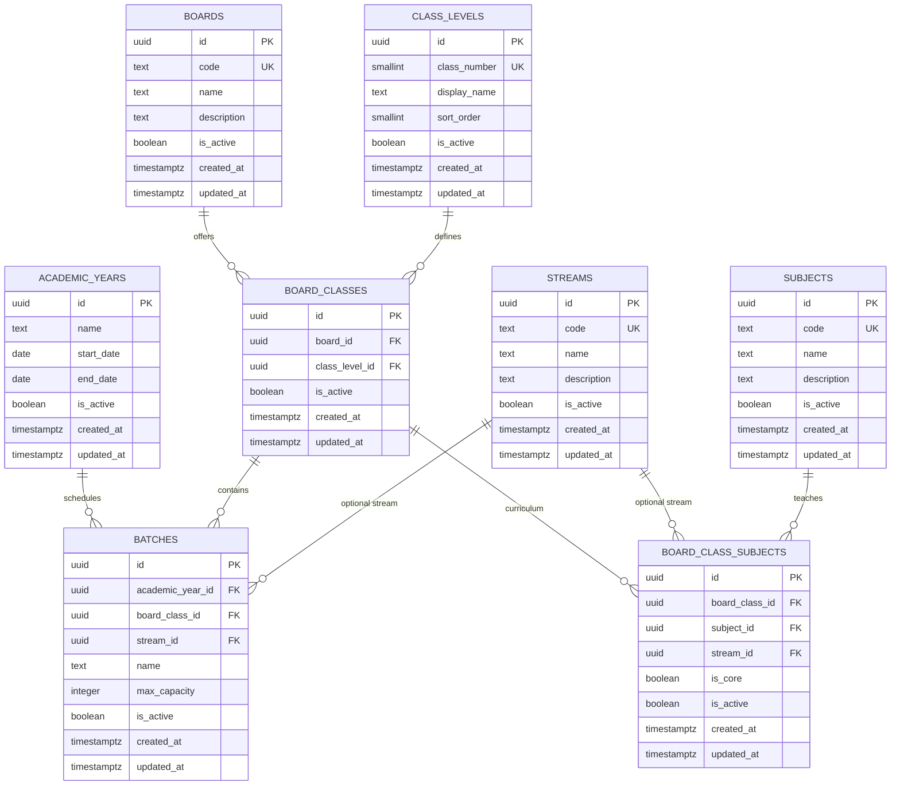

# EduCamp — Phase 3: Academic Master Data & Database Architecture

## 1. Executive Summary

Phase 3 establishes the normalized PostgreSQL master data architecture for EduCamp. Designed for an educational coaching institute (~500 students, 15 teachers, multiple boards, Classes 1–12, multiple batches, academic years, and stream pathways), this foundation strictly decouples master entities from student enrollments and eliminates comma-separated strings or board hard-coding.

All migrations are fully idempotent and versioned in `supabase/migrations/`.

---

## 2. Entity Relationship Overview

The academic structure decouples master definitions (Boards, Class Levels, Streams, Subjects) from contextual academic offerings (Board-Classes, Batches, Curriculum Subject Mappings) bound to Academic Years:



---

## 3. Database Schema & Tables

### 3.1. `academic_years`
- **Purpose**: Defines academic sessions (e.g. `2025-2026`, `2026-2027`).
- **Single Active Year Invariant**: Enforced at the database engine level via a partial unique index:
  ```sql
  CREATE UNIQUE INDEX idx_single_active_academic_year
    ON public.academic_years (is_active)
    WHERE is_active = true;
  ```
  This guarantees that at most one academic year can have `is_active = true` at any instant without needing error-prone client checks.

### 3.2. `boards`
- **Purpose**: Master table for governing educational boards (CBSE, ICSE, BSEB, etc.).
- **Extensibility**: Additional state boards or foreign boards can be inserted cleanly at runtime without schema alterations.
- **Constraints**: `code` has a `UNIQUE` constraint, uppercase check `CHECK (code = upper(code))`.

### 3.3. `class_levels`
- **Purpose**: Standardized grade levels from Class 1 through Class 12.
- **Constraints**: `class_number` is a `smallint` constrained by `CHECK (class_number BETWEEN 1 AND 12)` with a unique constraint. `sort_order` provides predictable UI sorting.

### 3.4. `streams`
- **Purpose**: Senior secondary specialization tracks (Science, Commerce, Arts/Humanities).
- **Constraints**: Unique `code` (`SCIENCE`, `COMMERCE`, `ARTS`).

### 3.5. `board_classes`
- **Purpose**: Relational bridge linking a Board to a Class Level (e.g. "CBSE Class 10", "ICSE Class 10", "BSEB Class 12").
- **Constraints**: Composite unique constraint `UNIQUE (board_id, class_level_id)`.
- **Architectural Value**: Eliminates duplicate class definitions while permitting board-specific curriculum mappings.

### 3.6. `batches`
- **Purpose**: Coaching sections / study batches (e.g. "Morning Batch", "Evening Batch", "Section A", "IIT-JEE Foundation").
- **Relationships**: Bound to `academic_year_id`, `board_class_id`, and an optional `stream_id`.
- **Unique Invariants**:
  - For stream-specific batches (Classes 11–12): `UNIQUE (academic_year_id, board_class_id, stream_id, name)` where `stream_id IS NOT NULL`.
  - For non-stream batches (Classes 1–10): `UNIQUE (academic_year_id, board_class_id, name)` where `stream_id IS NULL`.

### 3.7. `subjects`
- **Purpose**: Reusable master catalog of disciplines (Mathematics, Physics, Chemistry, Biology, English, Hindi, etc.).
- **Constraints**: `code` is unique and uppercase.

### 3.8. `board_class_subjects`
- **Purpose**: Curriculum mapping associating subjects with specific board-classes and optional streams.
- **Fields**:
  - `is_core`: Distinguishes mandatory foundation subjects from optional electives.
  - `stream_id`: `NULL` for universal subjects in Classes 1–10; populated for stream-specific subjects (e.g. Physics in CBSE 11 Science).
- **Unique Invariants**:
  - `UNIQUE (board_class_id, subject_id, stream_id)` when `stream_id IS NOT NULL`.
  - `UNIQUE (board_class_id, subject_id)` when `stream_id IS NULL`.

---

## 4. Key Architectural Decisions

### 4.1. Sections vs. Coaching Batches
- **Observation**: In standard schools, cohorts are called "Sections" (10-A, 10-B). In coaching institutes, cohorts are scheduled as "Batches" (Morning Batch, Evening Batch, Weekend Batch, Target NEET, Foundation IIT).
- **Decision**: EduCamp adopts the unified `batches` table. A batch record includes a flexible `name` string (e.g., `"Section A"`, `"Morning Batch - FastTrack"`). This caters to both formal school sectioning and coaching batch timing models without schema duplication.

### 4.2. Stream Strategy (Classes 11 & 12)
- **Problem**: Classes 1 through 10 have unified curricula, whereas Classes 11 and 12 branch into Science, Commerce, and Arts.
- **Decision**: Streams are modeled as a standalone master table `streams`. `stream_id` is made **nullable** in both `batches` and `board_class_subjects`.
  - Classes 1–10 records set `stream_id = NULL`.
  - Classes 11–12 records optionally link to `streams.id`.
  - Streams are never forced onto primary/middle school grades.

### 4.3. Deletion & Audit Strategy
- **Rule**: Academic master data must never be hard-deleted if referenced by operational tables (attendance, marks, fee ledgers in future phases).
- **Foreign Keys**: All foreign key relationships configure `ON DELETE RESTRICT`.
- **Soft Deactivation**: Every table features `is_active boolean NOT NULL DEFAULT true`. Inactive boards, discontinued subjects, or completed academic sessions are marked `is_active = false`.
- **Timestamps**: Every table contains `created_at` and `updated_at` (kept in sync via a shared PostgreSQL trigger `trg_set_updated_at`).

---

## 5. Row Level Security (RLS) & Authorization

Every table has RLS enabled (`ALTER TABLE ... ENABLE ROW LEVEL SECURITY;`).

1. **Read Access (`SELECT`)**:
   - Master data is publicly readable (`FOR SELECT USING (true)` or `TO authenticated USING (true)`).
   - This ensures lightweight, instantaneous access for splash, registration dropdowns, and student/teacher queries without privilege friction.

2. **Write Access (`INSERT`, `UPDATE`, `DELETE`)**:
   - Master data write access is strictly locked down to administrators using the custom security-definer helper:
     ```sql
     CREATE OR REPLACE FUNCTION public.is_admin()
     RETURNS boolean
     LANGUAGE sql
     SECURITY DEFINER
     STABLE
     AS $$
       SELECT EXISTS (
         SELECT 1 FROM public.profiles
         WHERE id = auth.uid()
           AND role = 'admin'
           AND is_active = true
       );
     $$;
     ```
   - Regular students and teachers have **0 write access**.
   - Direct anonymous or unauthenticated writes are completely rejected.

---

## 6. Indexing Strategy

Indexes have been purposefully created to match expected query access patterns while avoiding overhead on write operations:

| Index Name | Table | Columns / Conditions | Justification |
| :--- | :--- | :--- | :--- |
| `idx_single_active_academic_year` | `academic_years` | `(is_active) WHERE is_active = true` | Guarantees single active session constraint & instant lookup of current session. |
| `idx_boards_active` | `boards` | `(is_active)` | Quick filtering for active board dropdowns. |
| `idx_class_levels_sort` | `class_levels` | `(sort_order, is_active)` | Optimizes ordered grade listing (Class 1 -> Class 12). |
| `idx_board_classes_board` | `board_classes` | `(board_id)` | Speeds up retrieval of classes offered under a given board. |
| `idx_board_classes_class` | `board_classes` | `(class_level_id)` | Speeds up reverse lookup of boards offering a given class. |
| `idx_batches_academic_year` | `batches` | `(academic_year_id)` | High-frequency filter: batches within the active year. |
| `idx_batches_board_class` | `batches` | `(board_class_id)` | Filter batches belonging to a specific board-class. |
| `idx_batches_stream` | `batches` | `(stream_id) WHERE stream_id IS NOT NULL` | Speeds up senior batch queries. |
| `idx_bcs_board_class` | `board_class_subjects` | `(board_class_id)` | Main curriculum query: fetch subjects taught in a class. |
| `idx_bcs_subject` | `board_class_subjects` | `(subject_id)` | Reverse lookup: find all classes teaching a subject. |
| `idx_bcs_stream` | `board_class_subjects` | `(stream_id) WHERE stream_id IS NOT NULL` | Stream-specific curriculum filtering. |

---

## 7. Seed Data

The seed migration (`20261003000002_seed_academic_master_data.sql`) installs:
- **Academic Years**: `2025-2026` (archived), `2026-2027` (active), `2027-2028` (planned).
- **Boards**: `CBSE` (Central Board of Secondary Education), `ICSE` (Indian Certificate of Secondary Education), `BSEB` (Bihar School Examination Board).
- **Class Levels**: Classes 1 through 12 with proper display names and numerical sort orders.
- **Streams**: `SCIENCE`, `COMMERCE`, `ARTS`.
- **Subjects**: 12 foundation & senior subjects (`MATH`, `SCI`, `PHYS`, `CHEM`, `BIO`, `ENG`, `HIN`, `SST`, `CS`, `ACCT`, `BST`, `ECON`).
- **Board Classes**: Cartographic mapping of Classes 1–12 across all 3 seed boards (36 board-class offerings).
- **Curriculum**: Baseline core subjects seeded for CBSE Class 10 (Mathematics, Science, English, Hindi, Social Science).
- **Sample Batches**: Representative morning and evening batches for the active academic year.

---

## 8. Frontend Integration

A minimal, strongly-typed service layer has been created in:
- `src/types/academic.ts`: Domain models for all academic entities.
- `src/types/database.types.ts`: PostgREST table schemas and relationship definitions.
- `src/services/academicService.ts`: Data-access service exposing lean queries:
  - `getActiveAcademicYear()`
  - `getActiveBoards()`
  - `getClassLevels()`
  - `getStreams()`
  - `getSubjects()`
  - `getBoardClasses(boardId)`
  - `getBatchesByBoardClass(academicYearId, boardClassId)`
  - `getCurriculumSubjects(boardClassId, streamId)`

**Performance Note**:
- Queries specify exact projection columns (`select('id, code, name...')`) rather than wildcards (`select('*')`).
- No continuous polling or unnecessary startup API calls are executed.
- Master data is requested on-demand when relevant components mount.
