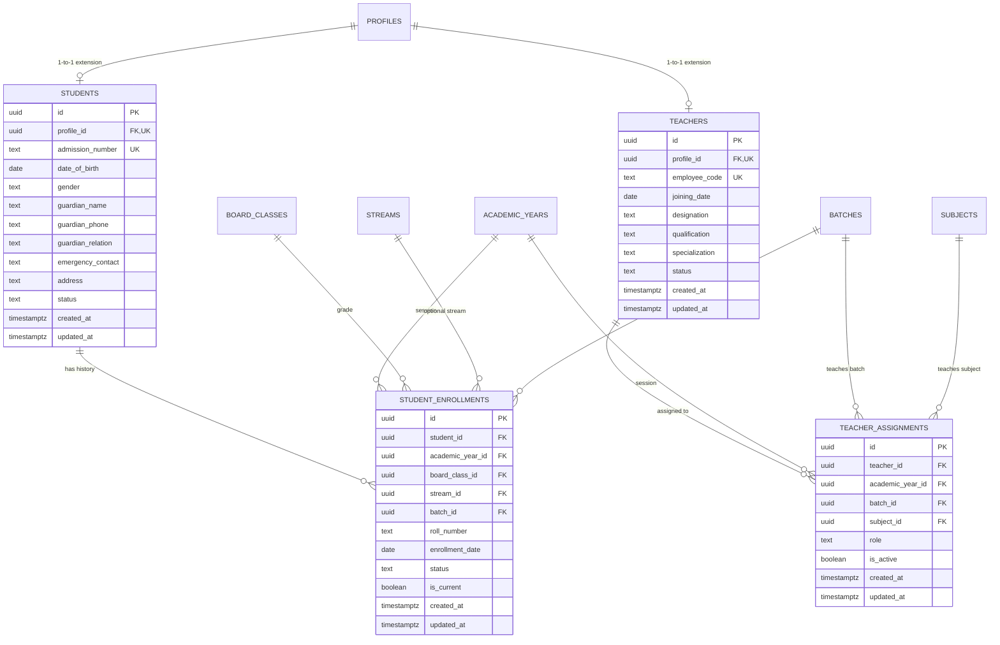

# EduCamp — Phase 4: Student, Teacher & Enrollment Foundation

## 1. Executive Summary

Phase 4 establishes the relational foundation for managing Students, Teachers, Student Academic Enrollments, and Teacher Academic Assignments in EduCamp. Built for an educational coaching institute (~500 students, 15 teachers, multiple boards, Classes 1–12, multiple batches, and multiple academic years), this architecture cleanly decouples identity (`profiles`) from domain roles (`students`, `teachers`) and captures full historical academic progression through `student_enrollments`.

---

## 2. Entity Relationship Overview



---

## 3. Database Schema & Core Entities

### 3.1. `students` Table
- **Purpose**: Represents the institute's official student entity linked 1-to-1 with `profiles`.
- **Foreign Key**: `profile_id REFERENCES public.profiles(id) ON DELETE RESTRICT`.
- **Identity & Contacts**:
  - `admission_number`: Human-facing unique identifier (e.g., `ADM-2026-0001`).
  - Contact & Guardian: `guardian_name`, `guardian_phone`, `guardian_relation`, `emergency_contact`, `address`.
  - Non-intrusive demographics: `date_of_birth`, `gender` (`male`, `female`, `other`).
- **Lifecycle Status**: Constrained by `CHECK (status IN ('active', 'inactive', 'transferred', 'completed'))`.

### 3.2. `student_enrollments` Table
- **Purpose**: Preserves full multi-year academic progression. Students are never tagged with static board or class strings on their identity record.
- **Relationships**:
  - `student_id REFERENCES public.students(id) ON DELETE RESTRICT`
  - `academic_year_id REFERENCES public.academic_years(id) ON DELETE RESTRICT`
  - `board_class_id REFERENCES public.board_classes(id) ON DELETE RESTRICT`
  - `stream_id REFERENCES public.streams(id) ON DELETE RESTRICT` (nullable, Classes 11–12 only)
  - `batch_id REFERENCES public.batches(id) ON DELETE RESTRICT`
- **Single Active Enrollment Constraint**:
  ```sql
  CREATE UNIQUE INDEX idx_student_single_current_enrollment_per_year
    ON public.student_enrollments (student_id, academic_year_id)
    WHERE is_current = true;
  ```
  Guarantees that a student cannot be simultaneously active in two different batches/grades in the same academic year.
- **Relational Integrity Trigger**:
  `trg_validate_student_enrollment_batch` executes before insert/update to verify:
  1. `batch.academic_year_id == enrollment.academic_year_id`
  2. `batch.board_class_id == enrollment.board_class_id`
  3. `batch.stream_id IS NOT DISTINCT FROM enrollment.stream_id`
  This eliminates cross-academic year or cross-class batch assignment anomalies at the database level.

### 3.3. `teachers` Table
- **Purpose**: Represents faculty members linked 1-to-1 with `profiles`.
- **Foreign Key**: `profile_id REFERENCES public.profiles(id) ON DELETE RESTRICT`.
- **Identity & Credentials**:
  - `employee_code`: Unique institute faculty ID (e.g., `TCH-001`).
  - Professional: `joining_date`, `designation`, `qualification`, `specialization`.
- **Lifecycle Status**: Constrained by `CHECK (status IN ('active', 'inactive', 'left'))`.

### 3.4. `teacher_assignments` Table
- **Purpose**: Normalizes faculty allocation across academic sessions, batches, and subjects.
- **Relationships**:
  - `teacher_id REFERENCES public.teachers(id) ON DELETE RESTRICT`
  - `academic_year_id REFERENCES public.academic_years(id) ON DELETE RESTRICT`
  - `batch_id REFERENCES public.batches(id) ON DELETE RESTRICT`
  - `subject_id REFERENCES public.subjects(id) ON DELETE RESTRICT`
- **Assignment Role**: `primary_teacher`, `assistant_teacher`, `substitute`.
- **Constraints**:
  - Unique assignment: `UNIQUE (teacher_id, academic_year_id, batch_id, subject_id)`.
  - Curriculum Validation Trigger: `trg_validate_teacher_assignment` verifies that the referenced `subject_id` is actually taught in the batch's `board_class` (from `board_class_subjects`).

---

## 4. Key Architectural Decisions

### 4.1. Decoupled Profile Extension Pattern
- `profiles` remains strictly focused on authentication identity (`id`, `full_name`, `email`, `phone_number`, `avatar_url`, `role`).
- `students` and `teachers` extend `profiles` via a 1-to-1 foreign key.
- Avoids wide monolithic tables, reduces column bloat, and provides clear privilege separation.

### 4.2. Historical Academic Enrollments
- In schools and coaching institutes, students transition through grades across academic sessions:
  - 2025–26: CBSE Class 9 (Batch A)
  - 2026–27: CBSE Class 10 (Batch B)
- All historical records remain intact for fee auditing, past marksheets, and attendance verification.
- `is_current = true` pinpoints the student's active cohort.

### 4.3. Admission Number & Employee Code Generators
- Two safe PostgreSQL helper functions were introduced:
  - `public.generate_admission_number(p_prefix)`: Returns sequential codes like `ADM-2026-0001`.
  - `public.generate_employee_code(p_prefix)`: Returns sequential codes like `TCH-001`.
- Enables rapid administrative onboarding while preserving custom institute prefix formats.

---

## 5. Row Level Security (RLS) & Authorization

Every table has Row Level Security enabled:

1. **`students`**:
   - Admins: Full management (`ALL`).
   - Students: Can read their own student record (`profile_id = auth.uid()`).
   - Teachers: Can view active student directory for academic duties (`EXISTS (SELECT 1 FROM profiles WHERE id = auth.uid() AND role = 'teacher')`).
   - Anonymous/Public: Denied (`0 access`).

2. **`student_enrollments`**:
   - Admins: Full management (`ALL`).
   - Students: Can view their own enrollment history (`student_id IN (SELECT id FROM students WHERE profile_id = auth.uid())`).
   - Teachers: Can view student enrollments for assigned coaching operations.

3. **`teachers`**:
   - Admins: Full management (`ALL`).
   - Teachers: Can view their own record (`profile_id = auth.uid()`).
   - Authenticated Users: Can view active faculty directory (`status = 'active'`).

4. **`teacher_assignments`**:
   - Admins: Full management (`ALL`).
   - Teachers: Can view their own assignments.
   - Authenticated Users: Can view active assignments (`is_active = true`).

---

## 6. Indexing Strategy

Targeted B-tree indexes optimize high-volume queries:

| Index Name | Table | Columns / Conditions | Justification |
| :--- | :--- | :--- | :--- |
| `idx_students_profile_id` | `students` | `(profile_id)` | 1-to-1 join from active auth session. |
| `idx_students_admission_number` | `students` | `(admission_number)` | High-frequency student search. |
| `idx_students_status` | `students` | `(status)` | Filtering active/inactive students. |
| `idx_teachers_profile_id` | `teachers` | `(profile_id)` | Fast lookup for logged-in faculty. |
| `idx_teachers_employee_code` | `teachers` | `(employee_code)` | Fast lookup by employee ID. |
| `idx_enrollments_student` | `student_enrollments` | `(student_id)` | Fetching complete academic history. |
| `idx_enrollments_batch` | `student_enrollments` | `(batch_id)` | Fetching all students in a batch. |
| `idx_enrollments_current` | `student_enrollments` | `(is_current) WHERE is_current = true` | Fast retrieval of active student rosters. |
| `idx_teacher_assignments_teacher` | `teacher_assignments` | `(teacher_id)` | Faculty schedule and subject queries. |
| `idx_teacher_assignments_batch` | `teacher_assignments` | `(batch_id)` | Finding assigned teachers for a batch. |

---

## 7. Frontend Integration

Created clean TypeScript models and lightweight services:
- `src/types/student.ts`: Domain models for Student, StudentProfile, StudentEnrollment, and EnrollmentDetail.
- `src/types/teacher.ts`: Domain models for Teacher, TeacherProfile, TeacherAssignment, and AssignmentDetail.
- `src/types/database.types.ts`: PostgREST table schemas and relationship definitions for Phase 4.
- `src/services/studentService.ts`: Data-access service for student profiles, pagination, and admission number generation.
- `src/services/enrollmentService.ts`: Data-access service for historical enrollments, active cohort, and batch rosters.
- `src/services/teacherService.ts`: Data-access service for faculty profiles, assignments, and employee codes.
