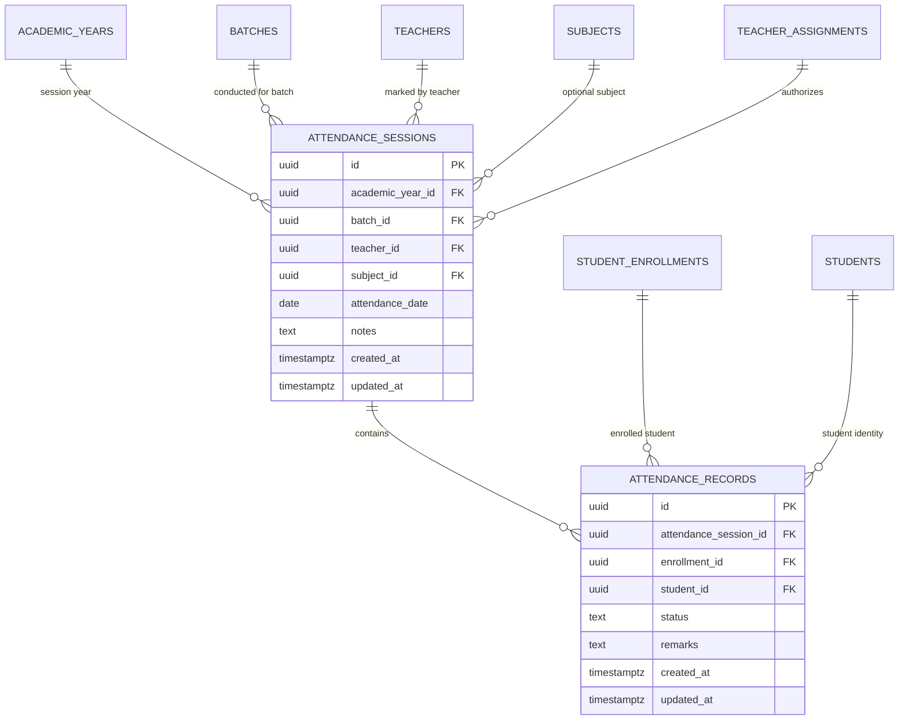

# EduCamp — Phase 5: Production-Grade Attendance System

## 1. Executive Summary

Phase 5 implements the production-grade attendance architecture for EduCamp. Designed for an educational coaching institute (~500 students, 15 teachers, multiple boards, Classes 1–12, multiple batches, and multiple academic years), this system anchors attendance records directly to student academic enrollments, guarantees transactional batch marking via an atomic RPC, enforces strict Row Level Security (RLS), and calculates student summaries on-the-fly without denormalization.

---

## 2. Entity Relationship Overview

Attendance is anchored directly to the student enrollment and coaching batch context:



---

## 3. Database Schema & Tables

### 3.1. `attendance_sessions` Table
- **Purpose**: Represents a discrete roll-call event for a batch on a specific calendar date (optionally subject-specific).
- **Date Type**: `attendance_date DATE NOT NULL` (stored strictly as PostgreSQL `DATE` rather than a timestamp to prevent timezone shifts across IST).
- **Session Duplicate Prevention**:
  1. *General Daily Attendance (`subject_id IS NULL`)*:
     ```sql
     CREATE UNIQUE INDEX idx_attendance_sessions_daily_unique
       ON public.attendance_sessions (batch_id, attendance_date)
       WHERE subject_id IS NULL;
     ```
  2. *Subject-Wise Attendance (`subject_id IS NOT NULL`)*:
     ```sql
     CREATE UNIQUE INDEX idx_attendance_sessions_subject_unique
       ON public.attendance_sessions (batch_id, subject_id, attendance_date)
       WHERE subject_id IS NOT NULL;
     ```

### 3.2. `attendance_records` Table
- **Purpose**: Stores individual student attendance status for a given session.
- **Relational Context**: References both `enrollment_id` and `student_id`.
  - Anchoring to `enrollment_id` ensures that historical attendance remains permanently bound to the student's cohort in that academic year (e.g. 2025–26 Class 9 vs 2026–27 Class 10).
- **Status Domain**: Constrained by `CHECK (status IN ('present', 'absent', 'late', 'leave'))`.
- **Record Duplicate Prevention**:
  - `CONSTRAINT uq_attendance_session_enrollment UNIQUE (attendance_session_id, enrollment_id)`
  - `CONSTRAINT uq_attendance_session_student UNIQUE (attendance_session_id, student_id)`
  Prevents any student from having more than one marked record in the same roll-call session.

---

## 4. Key Architectural Decisions

### 4.1. Batch Consistency Enforcement Trigger
- **Problem**: Accidental client errors or rogue requests attempting to mark a student in a batch they are not enrolled in.
- **Solution**: PostgreSQL trigger `trg_validate_attendance_record_enrollment` executes before insert or update on `attendance_records`:
  1. Verifies that `enrollment.student_id == record.student_id`.
  2. Verifies that `enrollment.batch_id == session.batch_id`.
  3. Verifies that `enrollment.academic_year_id == session.academic_year_id`.
  Any mismatch raises a database exception and aborts the transaction.

### 4.2. Atomic Bulk Attendance Submission (`submit_batch_attendance`)
- **Problem**: Marking 50 students in a batch via individual REST requests causes network chattiness, high latency on mobile networks, and leaves partial attendance states if a failure occurs halfway through.
- **Solution**: A PostgreSQL `SECURITY DEFINER` function:
  ```sql
  public.submit_batch_attendance(
    p_academic_year_id UUID,
    p_batch_id UUID,
    p_attendance_date DATE,
    p_subject_id UUID,
    p_records JSONB,
    p_notes TEXT
  )
  ```
- **Atomicity & Idempotency**:
  - Executes in a single database transaction.
  - Automatically verifies faculty authorization via `is_teacher_assigned_to_batch()`.
  - Upserts the session record and all student records (`ON CONFLICT (attendance_session_id, enrollment_id) DO UPDATE`).
  - Supports controlled corrections seamlessly without duplicating rows.

### 4.3. On-The-Fly Attendance Percentage Aggregation (`get_student_attendance_summary`)
- **Strategy**: Denormalizing attendance percentage into student rows introduces write amplification and race conditions.
- **Solution**: A lightweight aggregate RPC:
  ```sql
  public.get_student_attendance_summary(p_student_id UUID, p_academic_year_id UUID)
  ```
  Calculates `total_classes`, `present`, `absent`, `late`, `leave`, and `attendance_percentage` (`((present + late) / total) * 100`) dynamically using indexed queries.

### 4.4. Timezone Strategy
- **Standard**: Indian Standard Time (IST, UTC+5:30).
- **Rule**: All calendar dates for sessions are stored as PostgreSQL `DATE` (`YYYY-MM-DD`). Client timezone offsets cannot accidentally convert `2026-10-05` to `2026-10-04` or `2026-10-06`.

### 4.5. Offline & PWA Strategy
- Attendance submissions are strictly transactional and require active verification against database security triggers.
- The PWA Service Worker caches static assets and shells, but explicitly bypasses caching for `POST /rest/v1/rpc/submit_batch_attendance` and live attendance queries to prevent stale state.

---

## 5. Row Level Security (RLS) & Authorization

Every table has Row Level Security enabled:

1. **`attendance_sessions`**:
   - `SELECT`: Admins, teachers assigned to the batch, or students enrolled in the batch.
   - `INSERT / UPDATE`: Strictly restricted to authorized teachers assigned to the batch (or admins) via `is_teacher_assigned_to_batch(batch_id, subject_id)`.
   - `DELETE`: Admins only.

2. **`attendance_records`**:
   - `SELECT`:
     - Students can only view their **own** attendance records (`student_id IN (SELECT id FROM students WHERE profile_id = auth.uid())`).
     - Teachers can view records for sessions of their assigned batches.
     - Admins have full read access.
   - `INSERT / UPDATE`: Restricted to authorized teachers assigned to the session's batch (or admins).
   - `DELETE`: Admins only.
   - **Public/Anonymous**: 0 access.

---

## 6. Indexing Strategy

Targeted B-tree indexes optimize query access patterns for ~500 students:

| Index Name | Table | Columns | Justification |
| :--- | :--- | :--- | :--- |
| `idx_attendance_sessions_daily_unique` | `attendance_sessions` | `(batch_id, attendance_date) WHERE subject_id IS NULL` | Guarantees single daily roll-call per batch and optimizes date lookup. |
| `idx_attendance_sessions_subject_unique` | `attendance_sessions` | `(batch_id, subject_id, attendance_date) WHERE subject_id IS NOT NULL` | Guarantees single subject roll-call per batch per date. |
| `idx_attendance_sessions_batch` | `attendance_sessions` | `(batch_id)` | Fast lookup of batch attendance history. |
| `idx_attendance_sessions_date` | `attendance_sessions` | `(attendance_date)` | Calendar-based filtering. |
| `idx_attendance_records_session` | `attendance_records` | `(attendance_session_id)` | Fast join when loading session roster. |
| `idx_attendance_records_student` | `attendance_records` | `(student_id)` | Optimizes student summary aggregation & student history. |
| `idx_attendance_records_enrollment` | `attendance_records` | `(enrollment_id)` | Fast lookup by specific enrollment. |
| `idx_attendance_records_status` | `attendance_records` | `(status)` | Filter by status (e.g. absent list). |

---

## 7. Frontend Architecture & UI

- `src/types/attendance.ts`: Types for AttendanceSession, AttendanceRecord, BatchStudentRosterItem, SubmissionPayload, and Summary.
- `src/services/attendanceService.ts`: Data-access service wrapping roster retrieval, atomic submission, history queries, and summaries.
- `src/features/attendance/TeacherAttendanceScreen.tsx`: Mobile-first teacher interface:
  - Batch & Date selection.
  - Live count badges (Total, Present, Absent, Late, Leave, Unmarked).
  - Quick "Mark Rest Present" action.
  - Touch-friendly status buttons (`P`, `A`, `L`, `Lv`).
  - Sticky bottom action bar with save confirmation and unsaved changes alert.
- `src/features/attendance/StudentAttendanceScreen.tsx`: Student portal interface:
  - Overall Attendance Percentage score card with color tiers ($\ge 85\%$ green, $75-84\%$ light green, $65-74\%$ amber, $<65\%$ red).
  - Stat counters (Total, Present, Absent, Late/Leave).
  - Daily history timeline with status badges and teacher remarks.
- `src/features/attendance/AttendanceScreen.tsx`: Role-based route dispatcher at `/attendance`.
