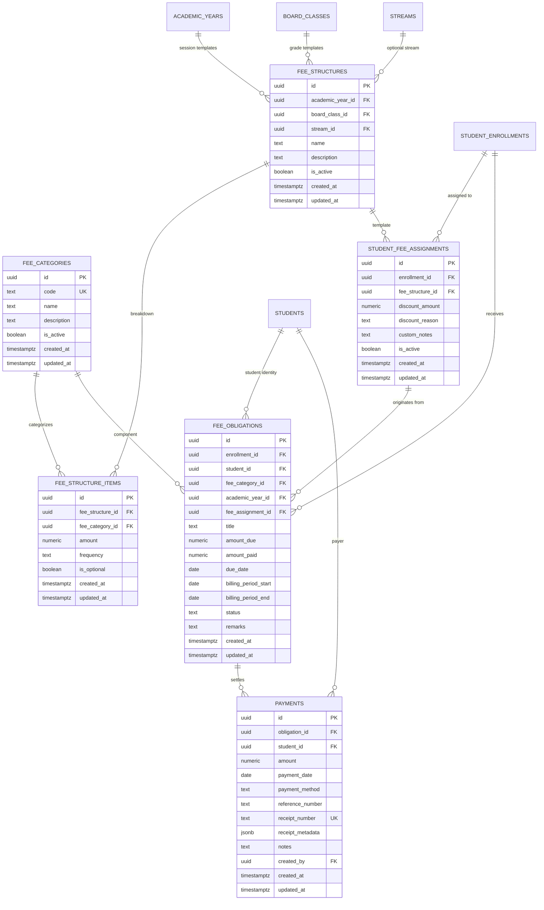

# EduCamp — Phase 6: Production-Grade Fee Management System

## 1. Executive Summary

Phase 6 implements the production-grade fee and financial ledger architecture for EduCamp. Designed for an educational coaching institute (~500 students, 15 teachers, multiple boards, Classes 1–12, multiple batches, and multiple academic years), this system eliminates single-field mutable balances, normalizes fee structures into modular components, preserves historical financial events, prevents overpayment at the database level, and records transactions atomically via a PostgreSQL stored procedure.

---

## 2. Entity Relationship Overview

Financial architecture decouples fee structure templates from student-specific fee obligations and immutable payment ledger entries:



---

## 3. Database Schema & Tables

### 3.1. `fee_categories` Table
- **Purpose**: Master table for distinct fee components (Tuition Fee, Admission Fee, Registration Fee, Examination Fee, Study Material Fee).
- **Extensibility**: Additional fee types can be added without schema alterations.

### 3.2. `fee_structures` & `fee_structure_items` Tables
- **Purpose**: Defines reusable fee templates associated with `academic_year_id`, `board_class_id`, and optional `stream_id`.
- **Items Breakdown**: Specifies `amount` and `frequency` (`one_time`, `monthly`, `quarterly`, `half_yearly`, `yearly`).
- **Constraint**: `UNIQUE (fee_structure_id, fee_category_id)` prevents duplicate item entries in the same structure.

### 3.3. `student_fee_assignments` Table
- **Purpose**: Links an enrolled student (`student_enrollments.id`) to a master fee structure.
- **Discounts & Scholarships**: Stores `discount_amount` and `discount_reason` (e.g. Merit Concession, Sibling Discount) without mutating master fee structures.

### 3.4. `fee_obligations` Table
- **Purpose**: Represents what the student is actually expected to pay for a particular billing period or event.
- **Fields**:
  - `amount_due NUMERIC(10, 2) NOT NULL CHECK (amount_due > 0)`
  - `amount_paid NUMERIC(10, 2) NOT NULL DEFAULT 0.00 CHECK (amount_paid >= 0)`
  - `due_date DATE NOT NULL`
  - `billing_period_start DATE` & `billing_period_end DATE`
  - `status VARCHAR(30) CHECK (status IN ('unpaid', 'partial', 'paid', 'waived', 'overdue'))`
- **Database-Level Invariant**:
  ```sql
  CONSTRAINT chk_obligation_paid_not_exceed_due CHECK (amount_paid <= amount_due)
  ```
  Guarantees that overpayment is rejected at the database level.
- **Duplicate Prevention**:
  ```sql
  CREATE UNIQUE INDEX idx_obligations_periodic_unique
    ON public.fee_obligations (enrollment_id, fee_category_id, billing_period_start)
    WHERE billing_period_start IS NOT NULL;
  ```

### 3.5. `payments` Table
- **Purpose**: Immutable financial ledger capturing every cash, UPI, or bank transaction.
- **Receipt Foundation**:
  - `receipt_number VARCHAR(50) NOT NULL UNIQUE` (e.g. `RCP-2026-0001`).
  - `receipt_metadata JSONB`: Captures a snapshot of student name, admission number, obligation title, amount paid, remaining balance, date, and cashier identifier for reproducible receipt displays.
- **Supported Payment Methods**: `cash`, `upi`, `bank_transfer`, `cheque`, `card`, `other`.

---

## 4. Key Architectural Decisions

### 4.1. Atomic Transaction Procedure (`record_fee_payment`)
- **Problem**: In concurrent multi-cashier environments, recording payment, updating obligation balances, and generating receipt numbers via separate client requests can cause race conditions or corrupt balances.
- **Solution**: A PostgreSQL `SECURITY DEFINER` stored procedure:
  ```sql
  public.record_fee_payment(
    p_obligation_id UUID,
    p_amount NUMERIC,
    p_payment_method VARCHAR,
    p_reference_number TEXT,
    p_notes TEXT
  )
  ```
- **Guarantees**:
  1. Verifies caller is administrator (`public.is_admin()`).
  2. Locks the obligation row `FOR UPDATE` to serialize concurrent cashier access.
  3. Rejects payment if `p_amount > (amount_due - amount_paid)`.
  4. Generates sequential unique receipt number `RCP-YYYY-XXXX`.
  5. Inserts immutable payment ledger record with receipt metadata.
  6. Recomputes and updates obligation `amount_paid` and `status` (`paid` or `partial`).
  7. Returns transaction details in a single round trip.

### 4.2. On-The-Fly Aggregation (`get_student_fee_summary`)
- Avoids denormalizing mutable fee balances into the `students` table.
- A lightweight PostgreSQL function calculates `total_due`, `total_paid`, `outstanding_amount`, `unpaid_count`, `partial_count`, and `paid_count` on-demand using indexed queries.

### 4.3. Partial Payment Ledger Model
- A ₹2,000 fee can be settled via multiple payments (e.g. ₹500, then ₹1,000, then ₹500).
- Each payment generates its own distinct receipt number and ledger entry.
- The previous payment records are never overwritten.

### 4.4. Timezone & Date Integrity
- Financial due dates, billing periods, and payment dates are stored strictly as PostgreSQL `DATE` in Indian Standard Time (IST, UTC+5:30).
- Prevents client browser timezone offsets from shifting billing dates.

---

## 5. Row Level Security (RLS) & Financial Privacy

Financial records are strictly confidential:

1. **`fee_categories`, `fee_structures`, `fee_structure_items`**:
   - `SELECT`: Authenticated users can read active templates.
   - `INSERT / UPDATE / DELETE`: Admins only.

2. **`fee_obligations` & `payments`**:
   - **Teachers**: **0 access** (preventing faculty from viewing student fee status).
   - **Students**: Strict read-only access to their **own** records (`student_id IN (SELECT id FROM students WHERE profile_id = auth.uid())`).
   - **Admins**: Full access to view, create obligations, and record payments.
   - **Public / Anonymous**: **0 access**.

---

## 6. Indexing Strategy

Targeted B-tree indexes optimize high-volume financial lookups:

| Index Name | Table | Columns | Justification |
| :--- | :--- | :--- | :--- |
| `idx_obligations_periodic_unique` | `fee_obligations` | `(enrollment_id, fee_category_id, billing_period_start)` | Prevents duplicate periodic billing and speeds lookup. |
| `idx_obligations_student` | `fee_obligations` | `(student_id)` | Fast retrieval for student portal summary. |
| `idx_obligations_status` | `fee_obligations` | `(status)` | Filtering unpaid and partial obligations for cash collection. |
| `idx_obligations_due_date` | `fee_obligations` | `(due_date)` | Due date sorting and aging queries. |
| `idx_payments_obligation` | `payments` | `(obligation_id)` | Joining payments against an obligation. |
| `idx_payments_student` | `payments` | `(student_id)` | Fast lookup for student payment history. |
| `idx_payments_receipt` | `payments` | `(receipt_number)` | Unique receipt verification and instant receipt lookup. |
| `idx_payments_reference` | `payments` | `(reference_number)` | Fast reconciliation by bank UTR / Cheque number. |

---

## 7. Frontend Integration & UI

- `src/types/fee.ts`: Complete TypeScript domain models (FeeCategory, FeeStructure, FeeObligationDetail, PaymentDetail, ReceiptMetadata, StudentFeeSummary).
- `src/services/feeService.ts`: Data-access service covering fee structures, pending obligations, atomic payment recording, summaries, and receipts.
- `src/features/fees/AdminFeeManagementScreen.tsx`: Admin cashier interface:
  - Pending student obligations list with remaining balance.
  - Payment collection modal with payment method selection (`cash`, `upi`, `bank_transfer`, `cheque`, `card`), reference number input, and instant receipt number generation.
  - Master fee structure templates viewer.
- `src/features/fees/StudentFeesScreen.tsx`: Student fee portal:
  - Overall Outstanding Balance score card with Total Expected and Total Paid counters.
  - Obligations list with status badges (`Unpaid`, `Partial`, `Paid`).
  - Payment receipts list with modal viewer for receipt metadata snapshots.
- `src/features/fees/FeesScreen.tsx`: Role-based route dispatcher at `/fees`.
